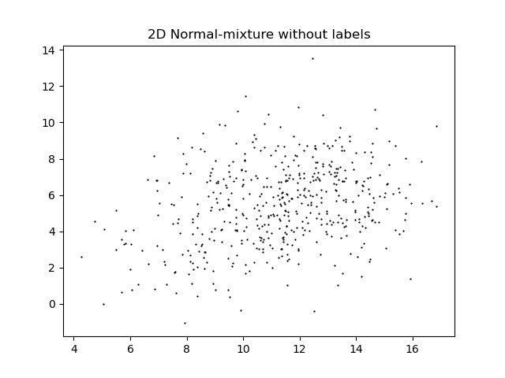
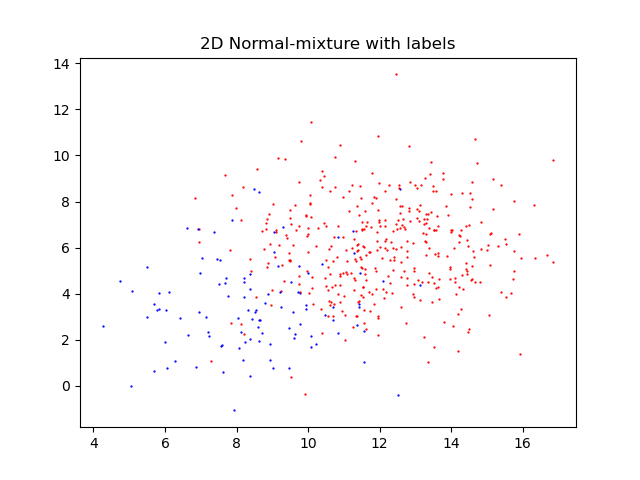

# Challenges

1. A very interesting 1-Dimensional mixture model in physics is the Gamma Ray Bursts time distribution
   

whose data is available <a href="https://gammaray.nsstc.nasa.gov/batse/grb/catalog/4b/index.html" target='grb'>here</a>.

    1. Create an script to extract the parameters of a mixture of LogNormal distributions.
    2. Analyze other features from the GRBs to see if one can explore whether this mixture has other interesting dimensions.  Observe that having already the time-duration as a clear handle to separate the classes could facilitate the analysis in other variables.

1. Let's consider a simple 2-Dimensional mixture model to get the main ideas behind.  Let's suppose that there is a mixture of 2 classes (1 and 2), and that each event has 2 observables ($A$ and $B$). We assume conditionally-independence: given the class, both observables are independent of each other (is this reasonable?). The data set consists of N events, where each event consists of 2 numbers.  To keep it simple, we'll assume that in both classes both observables are sampled from Normal distributions
    $$A_1 \sim N(\mu_{A1}, \sigma_{A1})$$
    $$B_1 \sim N(\mu_{B1}, \sigma_{B1})$$
And similarly
    $$A_2 \sim N(\mu_{A2}, \sigma_{A2})$$
    $$B_2 \sim N(\mu_{B2}, \sigma_{B2}).$$
We'll choose the true values for $\mu_i$, $\sigma_i$ such that it is not self-evident to which class belongs each event.

   - Observe that the dataset is a 2-Dimensional histogram. If you bin the outcome of $A$ and $B$ in $m_A$ and $m_B$ bins each, then the relevant info in the dataset are $m_A \cdot m_B$ numbers, no matter how many events there are in total.
   - Observe that this 2-Dimensional histogram will have some correlation between both observables, even though each class is conditionally-independent. 
   - Choose $\mu_i$, $\sigma_i$ and a mixing fraction $\pi_1$ and create a dataset.  That is a list of $N$ pairs of numbers.  As an example you could choose
      $$ \mu_{A1} = 8 , \sigma_{A1}=2,$$
      $$ \mu_{B1} = 3 , \sigma_{B1}=2,$$
      $$ \mu_{A2} = 12 , \sigma_{A2}=2,$$
      $$ \mu_{B2} = 6 , \sigma_{B2}=2,$$
      $$ \pi_1 = 0.2,$$
   or something similar.  Once you see the data you'll see that is quite hard/impossible to tell to which class belongs each event.  And moreover if you don't know the true values of $\mu_i$, $\sigma_i$, as we will assume.  The following plots correspond to the $N=500$ points distributed according the above parameters:

   - Create a STAN script to infer the model parameters from the data.  Observe that you are in the idealistic case in which the model to extract exactly matches how the data has been created.  Run the script and assess the convergence of its posterior to the true values.  Play varying the true values and the dataset size to explore how convergence behaves.
   - Count how many unknowns and 'equations' there are and discuss what would have happened if there would have not been conditionally-independence.  Discuss possible work-arounds to potential problems.

3. Think of everyday situations whose data may be thought as a mixture model.  There are much more of these of what you can imagine!  Ages in the train or bus, numbers of cars per unit time at highway, etc etc.  In each one of these situations, the parameters, or latent variables are telling us something about the system.  Discuss about it!
4. Think about mixture models at your work!  In your data!

